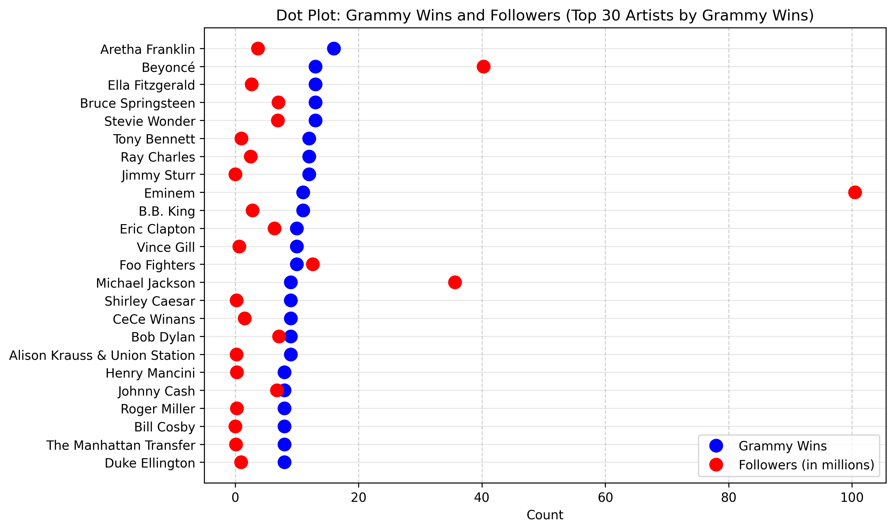
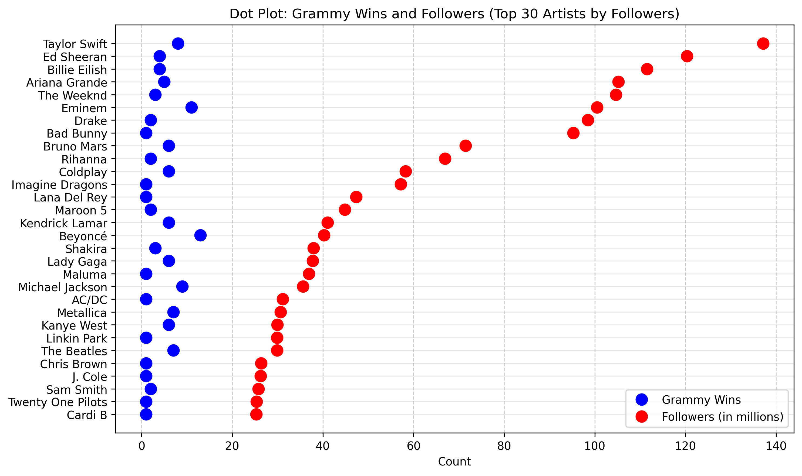

# Grammy Awards & Spotify Followers Analysis

A reproducible data pipeline exploring the relationship between Grammy wins and Spotify follower counts for music artists.

**Archived version with DOI:** [10.5281/zenodo.15385761](https://doi.org/10.5281/zenodo.15385761)

## Research Question

How does winning a Grammy award influence an artist's popularity on Spotify, as measured by follower count?

## Results

*Note: The visualizations below are the original outputs generated on May 11, 2025, and match the figures in the archived Zenodo record. Re-running the pipeline today will produce different plots, as Spotify follower counts change continuously.*

**Top 30 artists by Grammy wins, with their Spotify follower counts:**

**Top 30 artists by Spotify followers, with their Grammy win counts:**

The two lists barely overlap. Aretha Franklin, with the most career Grammys, has under 15M Spotify followers. Taylor Swift, Ed Sheeran, and Billie Eilish dominate Spotify followers without ranking in the top 30 Grammy winners. There is a positive but soft correlation between Grammy wins and Spotify followers — awards correlate with popularity but do not determine it.

## Stack

- **Python** (pandas, matplotlib, spotipy)
- **Snakemake** for workflow orchestration
- **Kaggle API** for the Grammy dataset
- **Spotify Web API** for follower data

## Project Structure

├── Scripts/              # Setup, data prep, and analysis scripts
├── Reports/              # Project plan, status report, final report
├── Visualizations/       # Output dot plots
├── data/                 # Populated at runtime
├── logs/                 # Populated at runtime
├── Snakefile             # Workflow definition
├── requirements.txt      # Python dependencies
└── .env.example          # Template for API credentials

## Reproducing the Analysis

1. Install Python and dependencies: `pip install -r requirements.txt`
2. Set up Kaggle API credentials ([instructions](https://www.kaggle.com/docs/api))
3. Create a Spotify developer app and copy credentials into a `.env` file (use `.env.example` as a template)
4. Run the full pipeline: `snakemake --cores 1`

The pipeline pulls both datasets, cleans and merges them, runs the analysis, and produces visualizations in `Visualizations/`.

## Data Sources

- Grammy Winners Dataset (Kaggle, CC0 Public Domain): [link](https://www.kaggle.com/datasets/unanimad/grammy-awards/data)
- Spotify Web API: [docs](https://developer.spotify.com/documentation/web-api/)

## Limitations & Future Work

- Grammy data covers 1958–2019; recent awards aren't reflected
- Spotify's monthly listener count isn't exposed via the API, so this uses followers as a proxy
- Spotify genre tags are inconsistent and were excluded from analysis
- Future iterations could containerize the pipeline (Docker) or expose results via a web interface